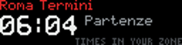
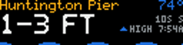

# RackTicker community plugins

Screens for [RackTicker](https://github.com/costamesatechsolutions/rackticker) that
are not part of it: each one a folder of its own, installed straight from its URL and
run in RackTicker's sandbox, so a plugin that misbehaves restarts alone and the panel
keeps going.

This is where community plugins live. RackTicker itself ships the screens that are
core to it; everything here is optional, and installed by whoever wants it.

## Install one

Open RackTicker's control page, go to **Plugins → Add a plugin**, and paste that
plugin's folder link. They also show up in the built-in browser, which reads
[index.json](index.json) from this repository.

| Plugin | What it does | Install |
| --- | --- | --- |
| [Departures](plugins/departures) | Live station boards: the London Underground in its own line colours, Metrolink and Amtrak across the United States, BART, and seven European stations, each drawn the way that country's boards look, with trains pulling into the platform. | [folder](https://github.com/costamesatechsolutions/rackticker-community-plugins/tree/main/plugins/departures) |
| [Onboard](plugins/onboard) | The strip map above the carriage doors, for a train that is really running: the line, the stops, the train sliding along it, and how long to the next one. | [folder](https://github.com/costamesatechsolutions/rackticker-community-plugins/tree/main/plugins/onboard) |
| [Surf](plugins/surf) | The surf at your break: wave height, swell period and direction, water temperature, and real water — a simulated sea driven by the actual swell, sitting high or low with the actual tide. | [folder](https://github.com/costamesatechsolutions/rackticker-community-plugins/tree/main/plugins/surf) |
| [Quakes](plugins/quakes) | Earthquakes around you from the USGS: a 24-hour seismograph drum, the latest shakes by size and distance, and a take-over when a strong one hits nearby. | [folder](https://github.com/costamesatechsolutions/rackticker-community-plugins/tree/main/plugins/quakes) |
| [Tanks](plugins/tanks) | Real levels as sloshing water: California's big reservoirs, and the space station's urine and water tanks when NASA's live feed answers. | [folder](https://github.com/costamesatechsolutions/rackticker-community-plugins/tree/main/plugins/tanks) |
| [Now playing](plugins/now_playing) | The song you are listening to, like an old car stereo: album art, the title and artist scrolling past, track number and time, and a segmented spectrum analyser. | [folder](https://github.com/costamesatechsolutions/rackticker-community-plugins/tree/main/plugins/now_playing) |
| [Virtual Aquarium](plugins/virtual_aquarium) | A living pixel aquarium: clownfish, angelfish, neon tetras, swaying plants and a wandering snail. Optionally mirrors real tank readings and lighting. | [folder](https://github.com/costamesatechsolutions/rackticker-community-plugins/tree/main/plugins/virtual_aquarium) |
| [Retro Screensavers](plugins/retro_savers) | Classic desktop nostalgia in 128×32 pixels: growing 3D pipes, Mystify trails, starfield, a bouncing four-pane badge and marquee text. | [folder](https://github.com/costamesatechsolutions/rackticker-community-plugins/tree/main/plugins/retro_savers) |
| [Arcade](plugins/arcade) | Ambient arcade: real games, played live by simple AIs at native resolution. | [folder](https://github.com/costamesatechsolutions/rackticker-community-plugins/tree/main/plugins/arcade) |
| [Formula 1](plugins/f1) | Formula 1: a start-light gantry counting down to lights out, the last race's podium and the championship fight. Key-free Jolpica (Ergast-compatible) API. | [folder](https://github.com/costamesatechsolutions/rackticker-community-plugins/tree/main/plugins/f1) |
| [Prediction markets](plugins/markets) | Read-only public prediction-market odds board; no trading capability. | [folder](https://github.com/costamesatechsolutions/rackticker-community-plugins/tree/main/plugins/markets) |
| [LED sign](plugins/ticker_wall) | Programmable LED sign: the storefront kind that spells words out of flying pixels, drops letters in, spins slot reels and chases marquee bulbs. | [folder](https://github.com/costamesatechsolutions/rackticker-community-plugins/tree/main/plugins/ticker_wall) |
| [Freeway traffic](plugins/traffic) | Freeway traffic board: live CHP incidents on nearby freeways, shown as a freeway shield, what happened, where, and how long ago. | [folder](https://github.com/costamesatechsolutions/rackticker-community-plugins/tree/main/plugins/traffic) |
| [Data from a link](plugins/url_data) | Any number or text from a JSON web address, shown as a big clean card. No code: paste a link and the field to show. | [folder](https://github.com/costamesatechsolutions/rackticker-community-plugins/tree/main/plugins/url_data) |

**Paste the plugin's folder URL, not this repository's root URL.** Each folder holds
its own `plugin.json`, code, licence, notes and previews.





## Write your own

Start from the [plugin starter](https://github.com/costamesatechsolutions/rackticker-plugin-starter):
a complete working screen in about forty lines, with an `AGENTS.md` written for Claude
Code, Codex and Cursor. A plugin is a folder, a `plugin.json` and one Python file.

From a RackTicker checkout, using its Python environment:

```sh
python -m app.dev new my_plugin
python -m app.dev check my_plugin    # renders on live data, writes preview.png
python -m app.dev push my_plugin --to rackticker.local:8081
```

`check` is the one that matters before you publish: it times your frame, renders it on
live data and says whether any letters are clipped. **Look at the preview image before
you believe it works.**

The full reference is [docs/plugins.md](https://github.com/costamesatechsolutions/rackticker/blob/main/docs/plugins.md),
and [AGENTS.md](AGENTS.md) here covers working in this repository.

## Add yours here

Open a pull request with one folder under `plugins/` and one entry in `index.json`
pointing at it. The folder needs `plugin.json`, your entry file, a `README.md`, a
`LICENSE`, an `AGENTS.md` and `preview.png` / `preview.gif` — `tests/test_catalog.py`
checks exactly that, and that your catalog entry matches your manifest.

Keep previews compact: RackTicker downloads the repository archive even when
installing a single folder, and enforces an archive-size limit.

Run the tests with a RackTicker checkout beside this repository:

```sh
PYTHONPATH=../rackticker python -m unittest discover -s tests -t .
```

Without one, the tests that need RackTicker skip and the catalog tests still run.

## Where these came from

Departures, Onboard, Surf, Quakes, Tanks and Now playing were part of the RackTicker
repository until they moved here, keeping their IDs, versions and settings. Virtual
Aquarium came from its own repository at commit `c345635`. Nothing already installed
on a panel is changed by the move; see [MIGRATION.md](MIGRATION.md).

## Licence

AGPL-3.0-only, the same as RackTicker. Each installable folder carries its own copy.

Built by [Costa Mesa Tech Solutions](https://github.com/costamesatechsolutions).
