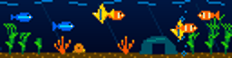

# Virtual Aquarium for RackTicker

A little living world for a 128 × 32 LED panel. Clownfish weave past an arch,
angelfish turn at the glass, neon tetras cross the tank, plants sway, bubbles
rise, and a snail makes very slow progress along the sand.



An independent third-party plugin derived from the
[CMTS plugin starter](https://github.com/costamesatechsolutions/rackticker-plugin-starter).
No changes to RackTicker are needed. Runs offline by default, with no account,
API key or network requests.

## Install

In RackTicker, open **Plugins → Add a plugin** and paste:

```
https://github.com/costamesatechsolutions/rackticker-community-plugins/tree/main/plugins/virtual_aquarium
```

It runs through RackTicker's normal third-party sandbox. This repository does not
install itself, change a playlist, or deploy to a device during development.

## Make it your tank

- **Habitat:** reef with orange branching coral, or planted with a school of tetras.
- **Fish count:** 1–12; defaults to 7.
- **Lighting:** day, night, or a 120-second artistic day/night cycle.
- **Speed:** 0.25–2×. Night lighting also slows the fish.
- **Bubbles:** switch the air stone on or off.
- **Show readings:** briefly display real readings every 16 seconds when connected.

All motion follows RackTicker's animation clock. The virtual fish are decorative;
this is not a model of animal health or a tank controller.

## Mirror a real aquarium

Optional: point **Tank URL** at a read-only HTTP(S) JSON endpoint that you own.
A Home Assistant / Node-RED flow or another sensor bridge can expose this contract:

```json
{
  "updated_at": "2026-09-20T04:15:00Z",
  "temperature_c": 25.4,
  "ph": 7.1,
  "light_on": true
}
```

`updated_at` is required: use the timestamp of the sensor observation, with a
UTC offset, not the time an old cached reading was requested. Supply one or more
of `temperature_c`, `ph`, and `light_on`; omitted readings are not invented.
This is a bridge contract, not direct compatibility with the Home Assistant REST
API or any aquarium controller. No bridge or physical tank is required for offline use.

- Fresh `light_on` controls the virtual lighting; otherwise your lighting setting applies.
- Temperature and pH appear on alternating visits of the readout, in Celsius and pH units.
- Readings over 30 seconds old show **STALE**, and stop controlling lighting.
- A failed fetch retains the previous snapshot through RackTicker's normal stale-data handling.
- Before any usable reading arrives, **NO DATA** appears and the aquarium keeps swimming.
- Blank Tank URL restores offline mode and hides previous sensor readings.
- Optional **Tank token** is a secret setting sent as a bearer token. Use HTTPS with a token.
- The provider only performs GET requests, refuses redirects, caps responses at 16 KiB,
  and times out after four seconds. RackTicker schedules polling (currently every five seconds).

No temperatures or chemistry readings are simulated or presented as live data.
The fish artwork does not mirror a webcam, identify real fish or control equipment.

## Development

Keep this repository beside a RackTicker checkout and use that checkout's environment:

```sh
# From the RackTicker checkout; output stays in the plugin folder.
PYTHONDONTWRITEBYTECODE=1 python -m app.dev check ../rackticker-virtual-aquarium --seconds 24
PYTHONDONTWRITEBYTECODE=1 python -m app.dev preview ../rackticker-virtual-aquarium

# From this repository, with RackTicker's public API installed:
python -m unittest discover -s tests -v
```

Read `AGENTS.md`. Inspect both `preview.png` and `preview.gif` after changing artwork.
The plugin imports only the public `rackticker` API, standard library, aiohttp and Pillow.

Community-directory submission is a separate future step. This repository is an
independently installable plugin; it does not modify RackTicker's community index.

## License

AGPL-3.0-only. Derived from Costa Mesa Tech Solutions' RackTicker plugin starter;
original license retained in `LICENSE`. This repository supplies the plugin source.

## Migration provenance

Copied without runtime code changes from [the standalone aquarium repository](https://github.com/costamesatechsolutions/rackticker-virtual-aquarium) at commit `c345635`. The original repository remains available. Future community development belongs in this folder.
